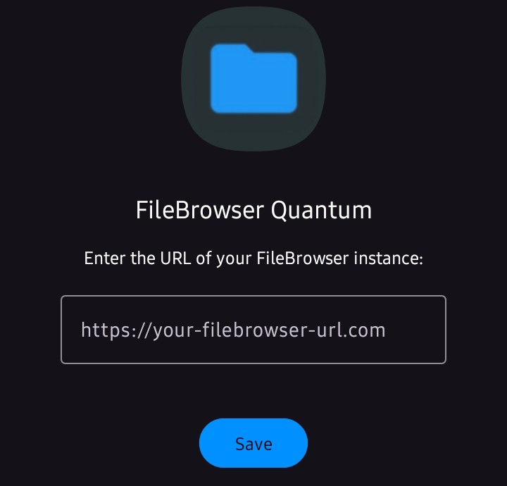
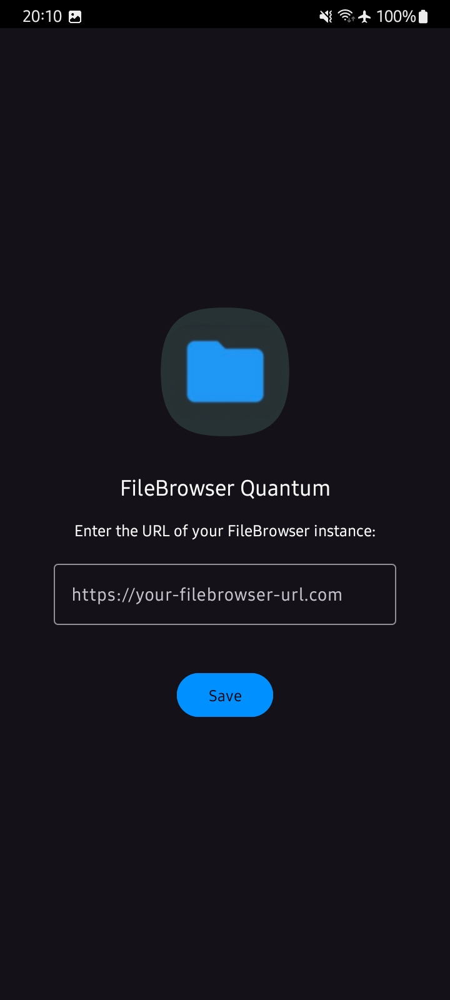
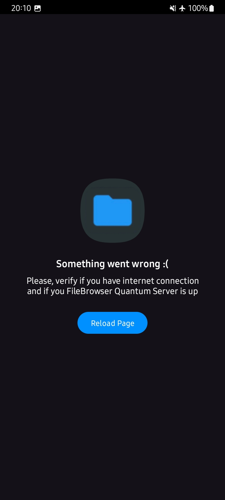
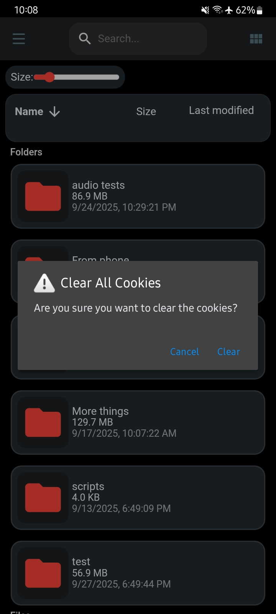
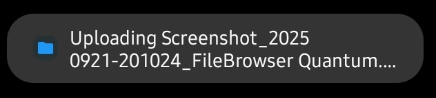
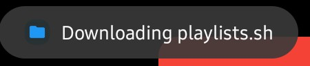
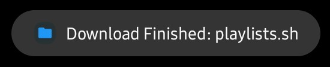

# Webview wrapper for Filebrowser Quantum
This Android app is a simple WebView wrapper for the [Filebrowser Quantum](https://github.com/gtsteffaniak/filebrowser) project, one of the best self-hosted web-based file managers that ever existed!

## Why I made this app? 
Well, you can install [Filebrowser Quantum](https://github.com/gtsteffaniak/filebrowser) as a webapp with your browser, this is possible thanks to the progressive web app technology that the browsers offer, **but** is only limited to the home screen.

I don't liked that... And that's why I made this app. I'd like to have separate cookies, browser cache from my main browser, and have quick access on my launcher
which is **search-focused**. My launcher don't let me add any "shortcut" to the home screen which is the only option that the browsers offer. And I think some users might be using a launcher similar to mine, or just those who would like to have it as a native-like app on their app drawer.

Before, I was using this app for my personal usecase, but I decided make it available for everyone :D

> This is my first time doing an app, and making a public project on github in general, if there are issues, or something I shouldn't have done, please, tell me, you can reach me on a discussion, issues or simply by my email.

## Usage
> Note: You need to have you filebrowser quantum server up and running, please visit the [Filebrowser Quantum repository](https://github.com/gtsteffaniak/filebrowser), If you haven't already.

Is very simple, just download the app from the [releases channel](https://github.com/Kurami32/Wrapper-for-Filebrowser-Quantum/releases) and install it on you desired device.
When you open the app for the first time, you will have a screen like this:

|  | 
|:---:| 

Just enter your Filebrowser URL and click on the "save" button. (Don't forget that the URL must contain `http://` or `https://` at the start).
Be cautious if you enter any other URL, or if you enter your URL wrong, you will need to clear the app data from android settings if you do.

## Features
- Is like any other app that you have on your phone, you can search it if you have a lot of apps with the app drawer of your phone launcher.
- Custom toast notification when uploading or downloading a file.
- Custom screen when there is no connection.
- Improved performance, this is possible thanks to hardware acceleration.
- Ability to refresh the page with two finger swipe down gesture.
- Ability to **delete cookies** with three finger swipe down gesture.

## Important notes
- How this is a WebView app, please, make sure that you have always up-to-date your webview component. If you are using another webview which is not the [default of Android](https://play.google.com/store/apps/details?id=com.google.android.webview&hl=en-US), I'm not sure how the app will behave.
- This is just a wrapper, basically a "mini-browser" that is just loading a specific URL provided (in this case, your filebrowser domain).
- If you found an issue related to this app, like a crash, the app not responding, etc. Feel free to open an issue **here**.
- If you found an issue non-related to this app (you find something on the WebUI or with filebrowser itself), please, go to the [filebrowser repository](https://github.com/gtsteffaniak/filebrowser), and try to reach the dev there, he is very welcoming :)

## Screenshots

|  |  |  |
|:---:|:---:|:---:|
| Setup screen | Network error screen | Cookie deletion warning |
|  |  |  |
| Upload toast notification | Download toast notification | Download/upload finished toast |

## Contributions
Feel free to open a PR if you think that something on the webview app could be improved/fixed! :D
See [Contributing](CONTRIBUTING.md)

## Licence
The code of the WebView app is licensed under the [MIT License](LICENSE).
