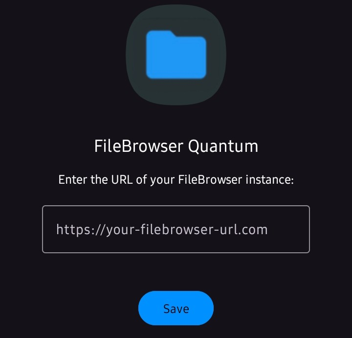
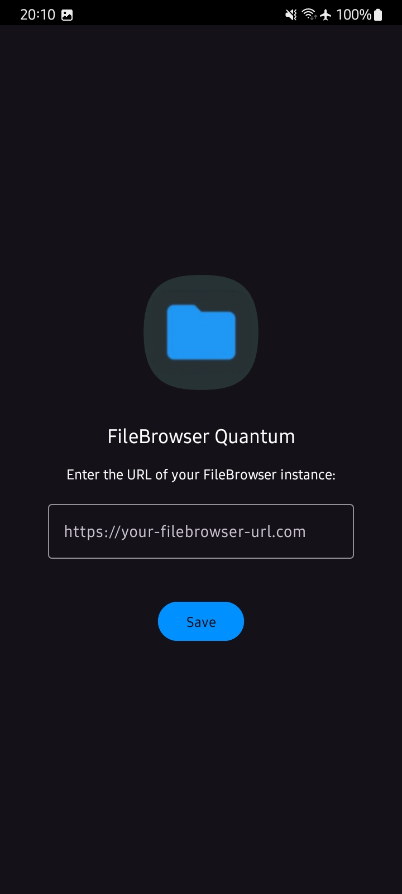
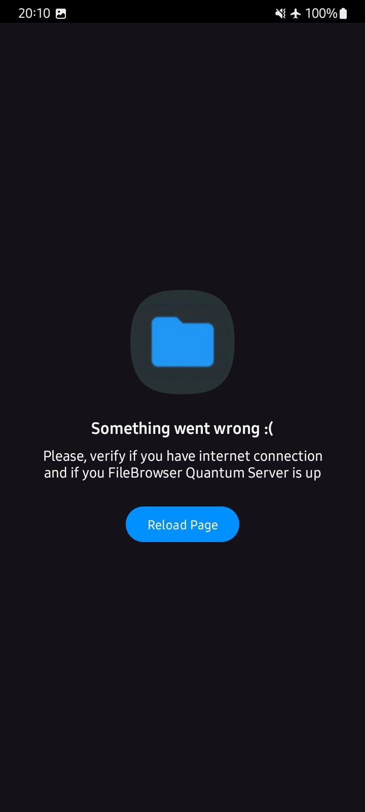
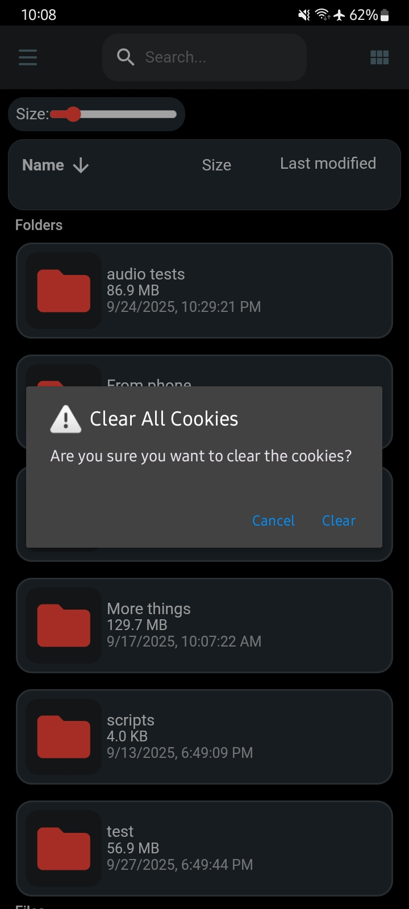
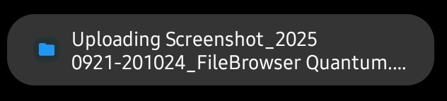
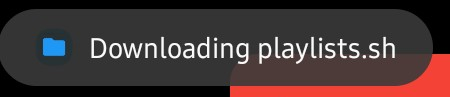
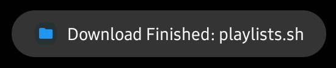

# Webview wrapper for Filebrowser Quantum
This Android app is a simple WebView wrapper for the [Filebrowser Quantum](https://github.com/gtsteffaniak/filebrowser) project, one of the best self-hosted web-based file managers that ever existed!

You can install [Filebrowser Quantum](https://github.com/gtsteffaniak/filebrowser) as a webapp within your browser as PWA (Progressive Web App) it works fine but is limited only to the home screen.

That's why I made this app (also because I'd like to have separate cookies and cache from my main browser). 

The app is just like any other app of your phone, it should appear in the app drawer of your launcher  letting you have a quick access -- also is searchable, allowing search-focused launchers find the app quickly.

> This is my first time doing an android app, and is also the first public project in GitHub, if there are issues or something, you can tell me, and will try to fix it :)

## Usage
> [!NOTE]
> You'll need to have a FileBrowser Quantum server running to use the app, if you are new to the Project, visit the [Filebrowser Quantum repository](https://github.com/gtsteffaniak/filebrowser) if you haven't already.

To use the app is very simple, just download the app from the [releases](https://github.com/Kurami32/Wrapper-for-Filebrowser-Quantum/releases) and install it on you desired device.

Opening the app for the first time, you will have a screen like this:

|  | 
|:---:| 

Just enter your Filebrowser URL and click on the "save" button. (Don't forget that the URL must contain `http://` or `https://` at the start).

Be cautious if you enter any other URL, or if you enter your URL wrong, you will need to clear the app data from android settings if you do.

## Features
- Is like any other app that you have on your phone, you can search it if you have a lot of apps with the app drawer of your phone launcher.
- Custom toast notification when uploading or downloading a file.
- Custom screen when there is no connection.
- Improved performance, this is possible thanks to hardware acceleration.
- Ability to refresh the page with two finger swipe down gesture.
- Ability to **delete cookies** with three finger swipe down gesture.

## Important notes
- How this is a WebView app, please, make sure that you have always up-to-date your webview component. If you are using another webview which is not the [default of Android](https://play.google.com/store/apps/details?id=com.google.android.webview&hl=en-US), I'm not sure how the app will behave.
- This is just a wrapper, basically a "mini-browser" that is just loading a specific URL provided (in this case, your filebrowser domain).
- If you found an issue related to this app, like a crash, the app not responding, etc. Feel free to open an issue **here**.
- If you found an issue non-related to this app (you find something on the WebUI or with filebrowser itself), please, go to the [filebrowser repository](https://github.com/gtsteffaniak/filebrowser), and try to reach the dev there, he is very welcoming :)

## Screenshots

|  |  |  |
|:---:|:---:|:---:|
| Setup screen | Network error screen | Cookie deletion warning |
|  |  |  |
| Upload toast notification | Download toast notification | Download/upload finished toast |

## Contributions
You can contribute with GitHub issues if you find something not working.

You can also open a PR if you want to improve something.

## Licence
This repo uses the [MIT License](LICENSE).
Feel free to use anything of the code :)