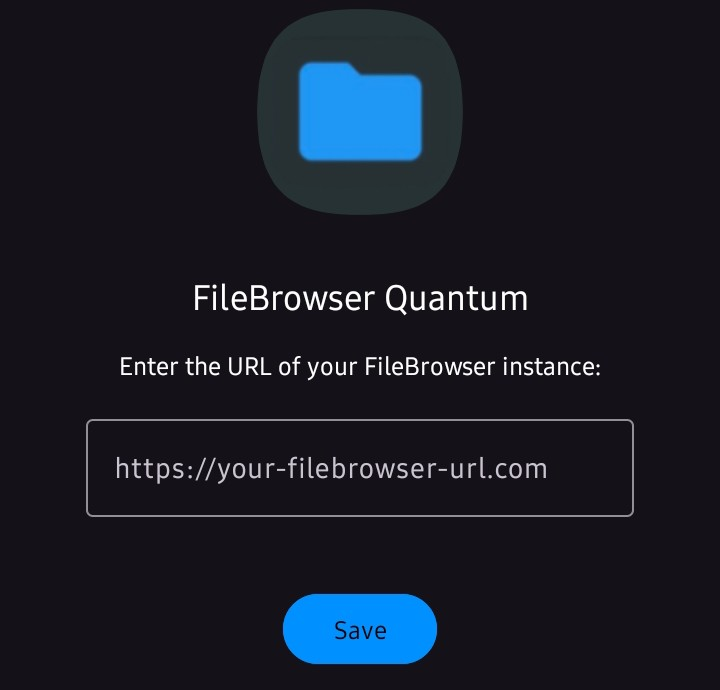
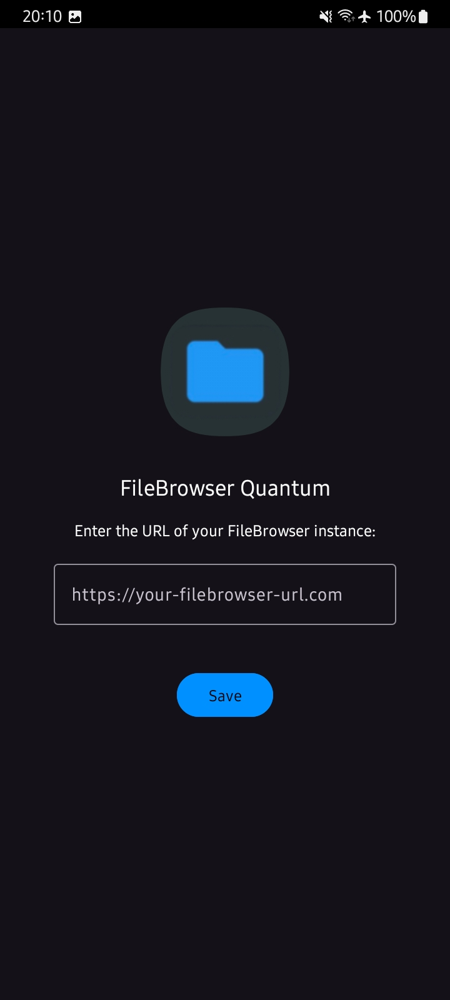
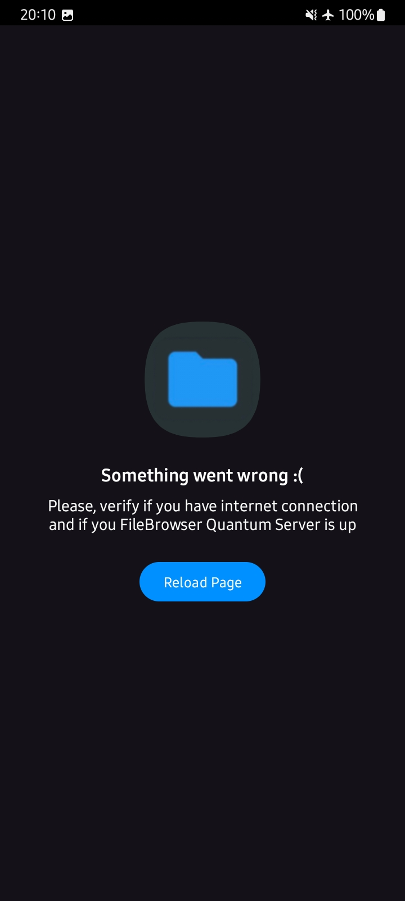
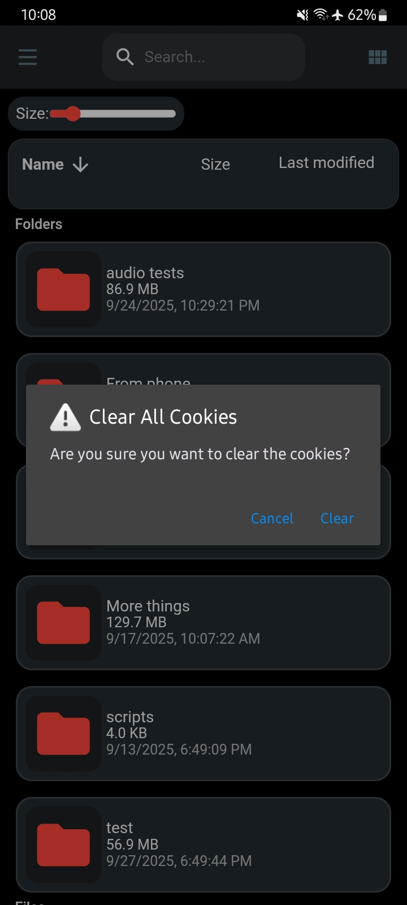
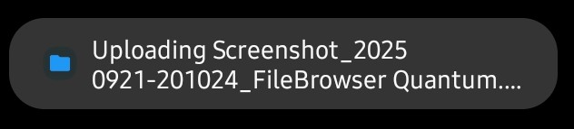
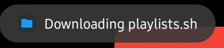
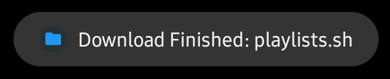

# Webview wrapper for Filebrowser Quantum
This Android app is a simple WebView wrapper for [Filebrowser Quantum](https://github.com/gtsteffaniak/filebrowser), one of the best self-hosted web-based file managers that ever existed!

You can install [Filebrowser Quantum](https://github.com/gtsteffaniak/filebrowser) as PWA (Progressive Web App) it works fine, but is limited only to the home screen (in certain launchers).

The app is just like any other app of your phone, it should appear in the app drawer of your launcher letting you have a quick access -- also is searchable, allowing search-focused launchers find the app quickly.

> This is my first time doing an android app, so... If there something can be improved, you can tell me, and will try :)

## Usage
> [!NOTE]
> You'll need to have a FileBrowser Quantum server running to use the app, visit the [FBQ repo](https://github.com/gtsteffaniak/filebrowser) if you haven't already.

To use the app is very simple, just download the app from the [releases](https://github.com/Kurami32/Wrapper-for-Filebrowser-Quantum/releases) and install it on you desired device.

When you open the app for the first time you will have a screen like this:

|  | 
|:---:| 

Just enter the URL of your FBQ server and click on the "save" button -- Don't forget that the URL must contain `http://` or `https://` at the begin :p

> [!IMPORTANT]
> Be cautious if you enter any other URL, or if you do a typo while setting the URL.
> If you do, just delete the app data from android settings to start again.
> The same applies if you want to change to other URL.

## Features
> [!NOTE]
> Since Filebrowser Quantum is having some PWA improvements lately (as of [v1.5.0-beta](https://github.com/gtsteffaniak/filebrowser/releases/tag/v1.5.0-beta)), this app may fall behind in feats. However, this app remains
> as an alternative to the PWA for those that don't need those features, or those that can't install PWAs due to some limitation (like launchers), I use it quite often for my own needs and as a quick shortcut when testing things mostly lol.

Some features that this app has are:

- Has a custom toast notification when uploading or downloading a file.
- Custom screen when there is no connection or the server is unreachable.
- It has a bit of better performance thanks to hardware acceleration and because is not running the full browser compared to webview.
- You can refresh the page using two (2) fingers swipe down gesture ⬇⬇
- You can also **delete cookies** using three (3) fingers swipe down gesture! ⬇⬇⬇

If I had to mention a disadvantage, is that you won't have media session (the notification with controls) when playing media files, I tried to implement it, but looks like WebView hasn't support for it.

## Screenshots

|  |  |  |
|:---:|:---:|:---:|
| Setup screen | Network error screen | Cookie deletion warning |
|  |  |  |
| Upload toast notification | Download toast notification | Download/upload finished toast |

## Important notes
- How this is a WebView app, make sure that you always have up-to-date your webview component. I have tested this using the default [WebView](https://play.google.com/store/apps/details?id=com.google.android.webview) that comes in most devices, so, if you are using some custom webview I'm not sure if the app will work.
- This is just a wrapper, it just loads a specific URL provided (even if you point to whatever other page, the app will load it) -- In this case will load our filebrowser web page and render it in WebView :)
- If you find some issue, like a crash, the app not responding, you can open an issue here.
- And if the issue is not related to the app but instead you something with the WebUI, go to the [FBQ repo](https://github.com/gtsteffaniak/filebrowser), and open an issue there. (But first test if is an issue related to my app by just trying to replicate in a normal browser).

## Know issues
- Looks like if you have chunked downloads enabled in FBQ it will not download the file, I'm not sure if this a WebView limitation or something else... I hadn't time to look into this.
- No media session or some PWA specific feats.

## Contributions
You can contribute opening some issue in case you found a bug, or a PR if you think something can be improved :p

## Licence
This repo uses the [MIT License](LICENSE), feel free to use anything of the code :)
